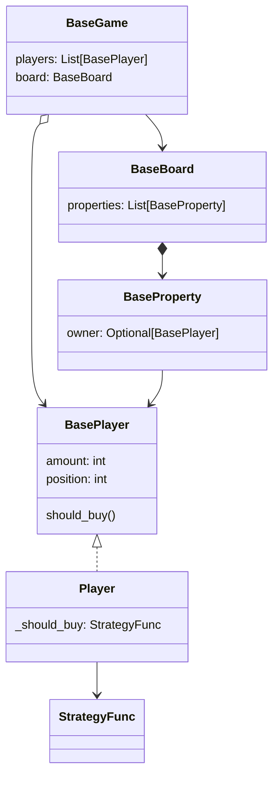

# Project Monopoly

## Summary

Implementation of a monopoly-like game, with over simplified rules. Pure python-based; no extra deps.  

## Rules

In this version of the game, the players will take turns, on a predefined random order set at the beginning of the match. Each player will start the game with 300 of amount.  

In this game, the board is composed by 20 properties in a sequence. Each property has a sale price, a rent value, an owner (if already bought) and follows a predefined order in the board. It is not possible to build hotels or any other upgrade in the properties of this board, for simplification purposes.

At the beginning of each turn, the player rolls an equiprobable 6-faces dice to determine how many slots in the board the player will walk.

- Upon landing on an unowned property, the player can choose whether or not to buy the property. This is the only way a property can be purchased.
- Upon landing on an owned property, the player must pay the owner the rent for the property.
- Upon completing a turn on the board, the player gains 100 of amount.

Players can only buy property if it has no owner and the player has enough money to buy it.
When buying a property, the player loses money and gains ownership of the property.

Each of the players has a different behavior implementation, which dictates the actions they take throughout the game. More details about that will be explained later.

A player who has a negative balance loses the game, and no longer plays. It loses its properties and therefore
can be purchased by any other player.

The game ends when there is only one player left with a positive balance at any time during the game. This player
is considered the winner.

We want to run a simulation to decide which is the best strategy. For this, we idealized a game
with 4 different types of possible players. The defined behaviors are:

- Player one is impulsive;
- Player two is demanding;
- Player three is cautious;
- Player four is random;

The impulsive player buys any property he lands on.  
The demanding player buys any property as long as its rent is greater than 50.  
The cautious player buys any property as long as he has a reserve of 80 balance left after the purchase is made.  
The random player buys the property he lands on with a 50% probability.  

If the game takes too long, as is usual in games of this nature, the game ends on the thousandth round with the victory of the player with biggest balance. The tiebreaker is the turn order of the players in this match.

## Output

An execution of the proposed program must run 300 simulations, printing in the console the referring data to executions. We hope to find the following information in the data:  
- How many matches end by time out (1000 rounds);
- How many turns on average does a game take;
- What's the win rate by player behavior;
- Which behavior wins the most?

## Implementation

The following diagram shows the relationship between the main classes.  
This design was made to allow the dependencies to be concentrated in the abstract layer, designated by the Base prefix, allowing a loose coupling between the concrete classes.  
The player "should_buy" behaviour uses a function-based strategy pattern to allow better extensibility.

